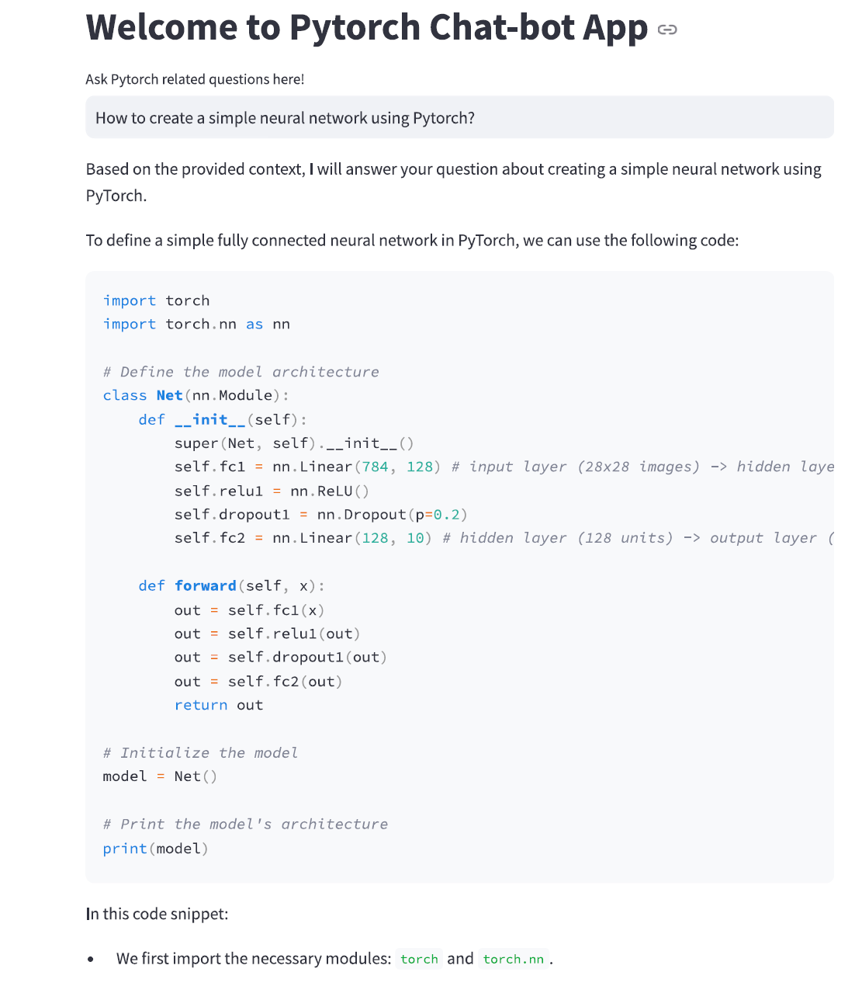

# LangGraph Powered RAG Workflow: Server Client Architecture

This project demonstrates the development of a server-client architecture for a graph workflow, incorporating advanced **Retrieval-Augmented Generation (RAG)** concepts. The end-to-end solution enables users to interact with the workflow via user-friendly interfaces built with **Streamlit** and **Gradio** while leveraging **LangGraph**, **FastAPI**, and **PyTorch documentaries** for core functionality.  

---

## Project Highlights  

1. **Server Component**:
   - Comprehensive pipeline for RAG processes, including:
     - **Grading Retrieved Documents**: Assessing the relevance and accuracy of retrieved data.
     - **Response Grading**: Evaluating the quality of generated responses.
     - **Hallucination Detection**: Identifying and mitigating inaccuracies in generated outputs.
     - **Query Rewriting**: Refining user queries for enhanced retrieval and response accuracy.

2. **Client Applications**:
   - **Streamlit Client**:
     - Offers a simple and intuitive interface for interacting with the server.
     - Supports real-time query submission and response visualization.
   - **Gradio Client**:
     - Provides an interactive and visually appealing user experience.
     - Ideal for testing and showcasing chatbot functionalities.

3. **Technologies Used**:
   - **LangGraph**: Framework for building advanced RAG pipelines.
   - **FastAPI**: Backend development for the server-side architecture.
   - **PyTorch Documentaries**: Provides deep learning capabilities for building intelligent chatbots.

4. **Local Testing**:
   - Fully functional environment for developers to build, test, and iterate locally before deploying to production.

---

## Output Preview  

Here is a sample output from the application:  

*The above image shows the interface and the response generated by the application when interacting with the server.*  
